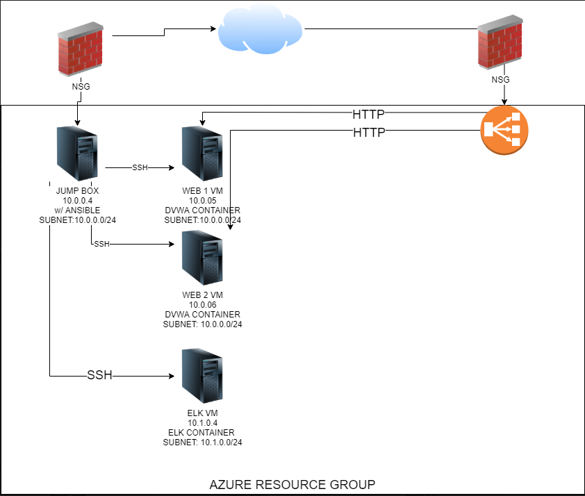

## Automated ELK Stack Deployment

The files in this repository were used to configure the network depicted below.



These files have been tested and used to generate a live ELK deployment on Azure. They can be used to either recreate the entire deployment pictured above. Alternatively, select portions of the `Elk.yml` file may be used to install only certain pieces of it, such as Filebeat.

  - _[Elk Playbook](Ansible/Elk.yml)_

This document contains the following details:
- Description of the Topologu
- Access Policies
- ELK Configuration
  - Beats in Use
  - Machines Being Monitored
- How to Use the Ansible Build


### Description of the Topology

The main purpose of this network is to expose a load-balanced and monitored instance of DVWA, the D*mn Vulnerable Web Application.

Load balancing ensures that the application will be highly available, in addition to restricting access to the network.
- _What aspect of security do load balancers protect? What is the advantage of a jump box?_
  - The aspect of load balancers is the availability and restraict people from the network. It will also mitigate against DoS attacks. The advantage of the jumpbox is that only the administrator has access to the jumpbox which allows them to connect to other machines within the network. This reduces the attack surface in case someone tries to invade our network. 

Integrating an ELK server allows users to easily monitor the vulnerable VMs for changes to the _____ and system _____.
- _What does Filebeat watch for?_
  - Filebeat will watch for SSH logins, sudo commands, and system logs. 
- _TODO: What does Metricbeat record?_
  - Metricbeat watches for CPU usage, RAM usage, and network usage.

The configuration details of each machine may be found below.
_Note: Use the [Markdown Table Generator](http://www.tablesgenerator.com/markdown_tables) to add/remove values from the table_.

| Name     | Function | IP Address | Operating System |
|----------|----------|------------|------------------|
| Jump Box | Gateway  | 10.0.0.4   | Linux            |
| Web-1    |    Webserver     |    10.0.0.5        |        Linux          |
| Web-2    |  Webserver        |    10.0.0.6        |    Linux              |
| ELK    | Network Monitoring System         | 10.1.0.4           |          Linux        |

### Access Policies

The machines on the internal network are not exposed to the public Internet. 

Only the `jumpbox` machine can accept connections from the Internet. Access to this machine is only allowed from the following IP addresses:
- _Only the administrator can access the jumpbox_

Machines within the network can only be accessed by `Ansible container`.
- _ Which machine did you allow to access your ELK VM? What was its IP address?_
  -  IP address: 

A summary of the access policies in place can be found in the table below.

| Name     | Publicly Accessible | Allowed IP Addresses |
|----------|---------------------|----------------------|
|     Jump Box | Yes (SSH)         | My IP Address   |
|     Web-1     |  No (SSH)    Yes (HTTP)               |      My IP Address                |
|     Web-2          | No (SSH)      Yes (HTTP)              |    My IP Address                 |
|     ELK      | No (SSH)        Yes (HTTP)             |       My IP Address               |

### Elk Configuration

Ansible was used to automate configuration of the ELK machine. No configuration was performed manually, which is advantageous because...
- _TODO: What is the main advantage of automating configuration with Ansible?_
  - It was easier implement version control in terms of installing certain software on the machines. It also saved us a lot of time to install all of these software without needing to manually SSHing into each machine.

The playbook implements the following tasks:
- _TODO: In 3-5 bullets, explain the steps of the ELK installation play. E.g., install Docker; download image; etc._
- Step 1. Install docker.io
- Step 2. Install pip3
- Step 3. Install Docker python module

The following screenshot displays the result of running `docker ps` after successfully configuring the ELK instance.


### Target Machines & Beats
This ELK server is configured to monitor the following machines:
- _TODO: List the IP addresses of the machines you are monitoring_
  - Web-1: 10.0.0.5
  - Web-2: 10.0.0.6
  
We have installed the following Beats on these machines:
- _Specify which Beats you successfully installed_
  - Filebeat

These Beats allow us to collect the following information from each machine:
- _In 1-2 sentences, explain what kind of data each beat collects, and provide 1 example of what you expect to see. E.g., `Winlogbeat` collects Windows logs, which we use to track user logon events, etc._
  - Fileabt collect SSH logins, system logs, and sudo commands 

### Using the Playbook
In order to use the playbook, you will need to have an Ansible control node already configured. Assuming you have such a control node provisioned: 

SSH into the control node and follow the steps below:
- Copy the `/etc/ansible/filebeat-config.yml` file to `/etc/filebeat/filebeat.yml`.
- Update the `/etc/filebeat/filebeat.yml` to include the localhost url for elastic and kibana.
- Run the playbook, and navigate to https://ipaddress:5601 to check that the installation worked as expected.

_TODO: Answer the following questions to fill in the blanks:_
- _Which file is the playbook? Where do you copy it?_
  - `elk.yml` and I copy it in the `/etc/ansible` folder
- _Which file do you update to make Ansible run the playbook on a specific machine? How do I specify which machine to install the ELK server on versus which to install Filebeat on?_
   `/etc/ansible/hosts`and I would create a server group and list all of the ip addresses below that. For example, if I wanted the elk machines to have certain programs installed, I would label it like this:
 ```
[elk]
 <insert IP addresses>
```
- _Which URL do you navigate to in order to check that the ELK server is running?
  -  https://ipaddress:5601   

_As a **Bonus**, provide the specific commands the user will need to run to download the playbook, update the files, etc._
  - `ansible-playbook <filename.yml>` `nano <filename.yml>`